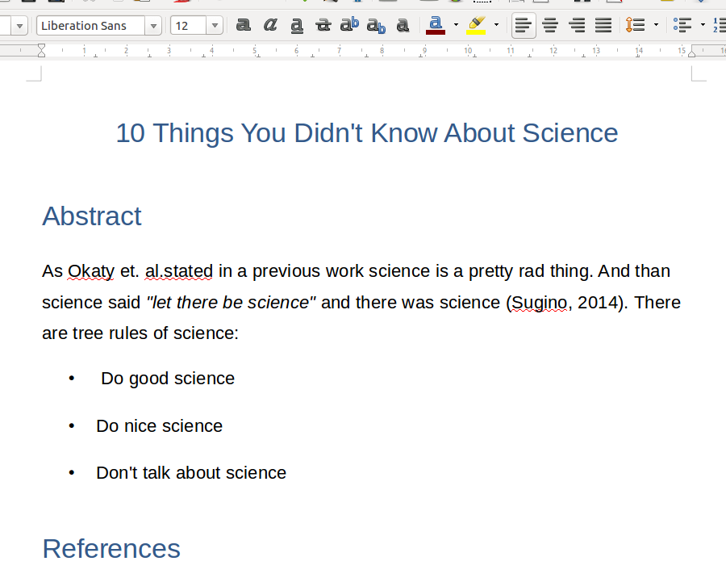
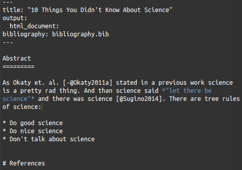
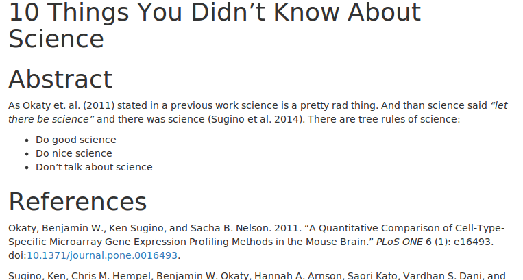
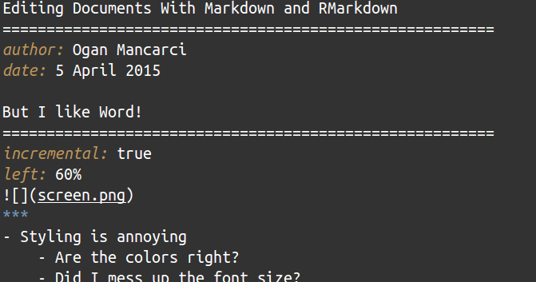
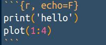
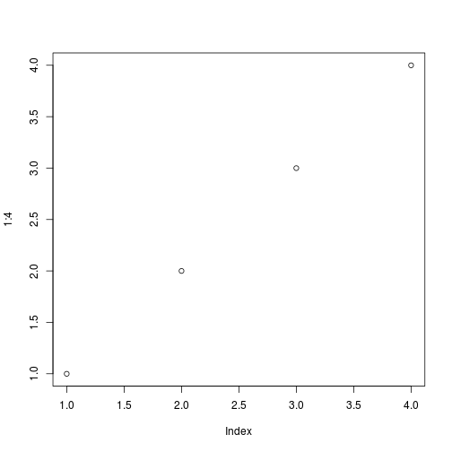
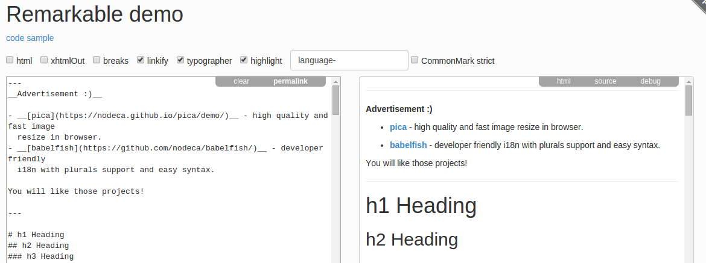

Editing Documents With Markdown and RMarkdown
========================================================
author: Ogan Mancarci
date: 5 April 2015

But I like Word!
========================================================
incremental: true
left: 60%

***
- Styling is annoying
    - Are the colors right?
    - Did I mess up the font size?
    - Will copy-paste will break formatting?
    - Does it fit the style guide?


Welcome to Markdown
========================================================

- Focus on writing when writing
- Be flexible with formatting

***



What will you lean?
========================================================
incremental: true
type: prompt

- Expected outputs from simple markdown syntax
- What tools to use to write and render markdown
- Where to look for more resources
- 


Syntax
=======================================================
incremental: true

Since this is also markdown...

```md
# Document 
I am **important** document. Or a *documentus importus* as the old ones say
```

# Document 
I am **important** document. Or a *documentus importus* as the old ones say


Syntax
====================================================
```
# High Header
## Low header
### Lower header
```
# High Header
## Low header
### Lower header

Syntax
====================================================
```
* This point matters
* This one matters more
    - This one matters less
```

* This point matters
* This one matters more
    - This one matters lesll

Rmarkdown
====================================
incremental: true




```r
print('hello')
plot(1:4)
```

***


```
[1] "hello"
```

 

What to use it with?
==============================
* Pandoc
 * Render into html, pdf, word, latex...
 * Command line
* Rstudio
 * RMarkdown with R code
 * Minimal effort in rendering
* Remarkable
 
 
Can you use this?
========================================================
type: prompt
incremental: true


* Manuscript writing
* Quick note taking
* Reproducible research
* Oh no I don't have enough time to prepare this lecture! If only I had something to deal with slide formatting :(


I'm done
=======================
* Markdown is a low-learning-curve markup language for creation of documents
* Enables users to focus on the content rather than its appearence
* Closes the gap between data and the text


